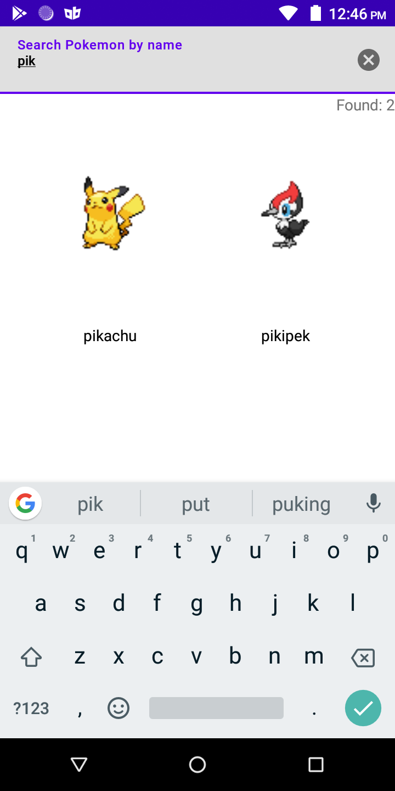
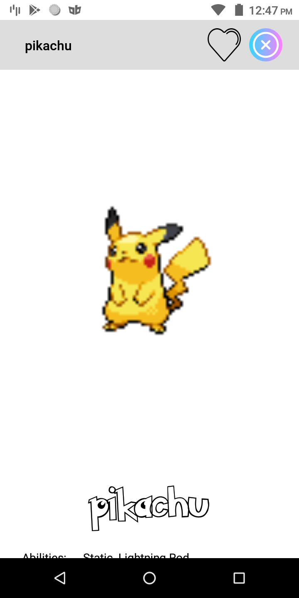
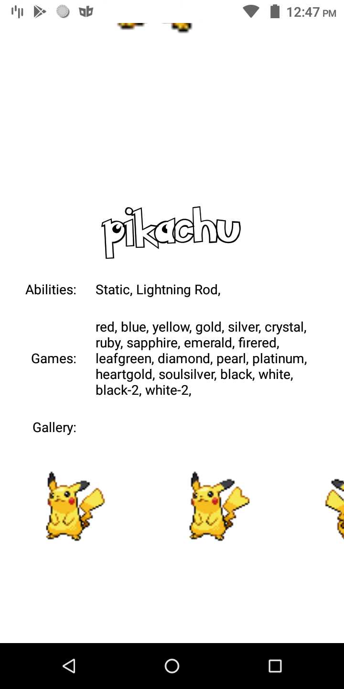

# Pokemon
Example application build on https://dex-server.herokuapp.com/ API as an architecture test case.

The purpose of this application is to show usage of some basic libraries and architecture concepts:
* Clean architecture
* MVVM
* Data binding
* coroutines, flows
* GraphQL
* LiveData
* Lottie
* Glide
* FastAdapter

## Screen shots

Further development should be focused on:
* androidTests
* Support for animations and transitions
* Rebuild app structure to use advantages of graphQL

